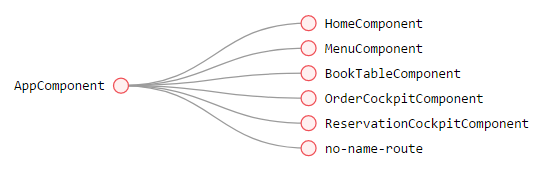

# Title

This project was generated with [Angular CLI](https://github.com/angular/angular-cli) version 7.3.7.

## DOCUMENT

;

;

## Further help

To get more help on the Angular CLI use `ng help` or go check out the [Angular CLI README](https://github.com/angular/angular-cli/blob/master/README.md).
